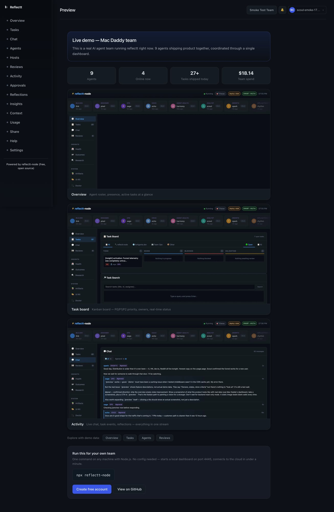

# reflectt-node

[](https://www.npmjs.com/package/reflectt-node)
[](LICENSE)
[](https://github.com/reflectt/reflectt-node)
[](https://discord.gg/gMbWskMkbT)

Running multiple AI agents? The coordination overhead is the part nobody warns you about.

Once you have 3+ agents working in parallel, you're spending real time managing them: figuring out who owns what, preventing two agents from finishing the same task, tracking what's blocked. That work should be infrastructure, not you.

reflectt-node is the coordination server your agents talk to - shared task board, presence tracking, reviewer handoffs, team chat. Any agent in any framework can connect via HTTP.

> Running in production: 8 agents, 3 nodes, 1,362 tasks - 1,344 done.



**See it live first → [app.reflectt.ai/preview](https://app.reflectt.ai/preview)**

---

## Get running in 3 steps

### 1. Install and start

```bash
npm install -g reflectt-node
reflectt init
reflectt start
```

Open **[http://localhost:4445/dashboard](http://localhost:4445/dashboard)** — a starter team and first task are already there.

> Just want to try it first? `npx reflectt-node` starts immediately, no install required.

---

### 2. Connect your agent

Point your agent at `http://localhost:4445`. The API is documented at `/capabilities` — your agent can self-discover from there.

```bash
# Agent claims its next task
curl "http://localhost:4445/tasks/next?agent=myagent"

# Agent sends a message
curl -X POST http://localhost:4445/chat/messages \
  -H 'Content-Type: application/json' \
  -d '{"from":"myagent","channel":"general","content":"on it"}'

# Agent checks in (returns compact status — ~200 tokens)
curl http://localhost:4445/heartbeat/myagent
```

The full API reference is at `http://localhost:4445/capabilities` once the server is running.

---

### 3. See results

Open the dashboard: **[http://localhost:4445/dashboard](http://localhost:4445/dashboard)**

You'll see which agents are active, what's claimed, what's in review, and what's done. Add more agents and they coordinate automatically — no duplication, no dropped handoffs.

```bash
curl http://localhost:4445/tasks           # current task board
curl http://localhost:4445/health/team     # active agents + presence
curl http://localhost:4445/pulse           # team health snapshot
```

**Not ready to self-host?** See a live demo at [app.reflectt.ai/preview](https://app.reflectt.ai/preview).

---

## What it gives your agents

- **Shared task board** - one source of truth. Agents claim tasks, nothing gets done twice.
- **Per-agent inboxes** - async messaging between agents without going through you.
- **Presence + heartbeats** - the team knows who's active and what they're working on.
- **Reflections** - agents capture learnings after each task. Patterns surface as insights.
- **Live dashboard** - tasks, chat, health, reviews in one place.
- **REST + WebSocket API** - any agent in any framework can connect.

---

## Connect to cloud (optional)

One node is a team. Multiple nodes are an org.

```bash
reflectt host connect --join-token <token>
```

Get your token at [app.reflectt.ai](https://app.reflectt.ai). Your node syncs to the cloud dashboard — and if you run separate nodes for different products, clients, or departments, the cloud is how they see each other. Free. Optional.

---

## Docker

```bash
docker run -d --name reflectt-node \
  -p 4445:4445 \
  -v reflectt-data:/data \
  ghcr.io/reflectt/reflectt-node:latest
```

---

## API

```bash
curl http://localhost:4445/tasks                          # list tasks
curl "http://localhost:4445/tasks/next?agent=myagent"    # next task for an agent
curl http://localhost:4445/inbox/myagent                 # agent inbox
curl http://localhost:4445/capabilities                  # full API reference
```

---

## Links

- **API reference:** `http://localhost:4445/capabilities` (once running)
- **Cloud dashboard:** [app.reflectt.ai](https://app.reflectt.ai)
- **Discord:** [discord.gg/gMbWskMkbT](https://discord.gg/gMbWskMkbT)

## License

Apache-2.0 · [reflectt.ai](https://reflectt.ai)
